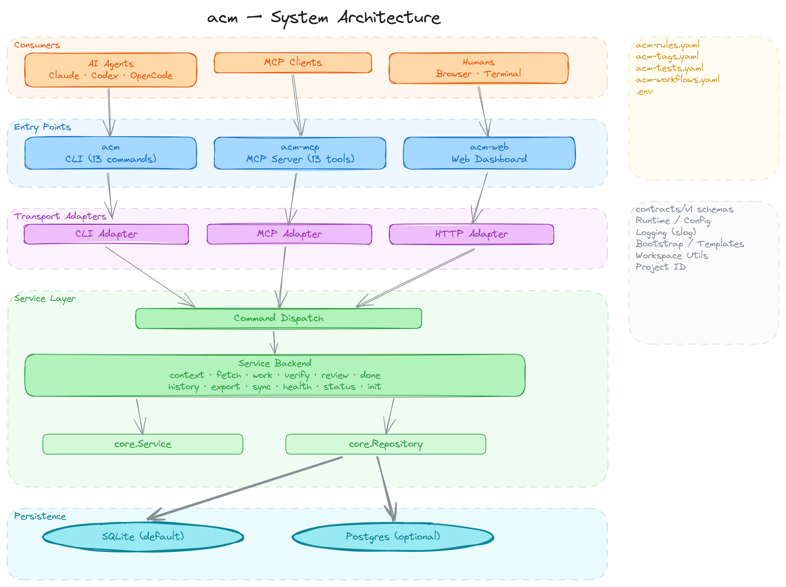

# Maintainer Reference

Purpose: hold slow-path maintainer reference material that is useful but not worth loading on every task.
Audience: maintainers and agents working on ACM itself.
Update when: architecture, sync obligations, test taxonomy, or troubleshooting guidance changes.
Not for: day-to-day task startup. Read [AGENTS.md](../AGENTS.md) first.

Use [docs/maintainer-map.md](maintainer-map.md) to choose a starting point. Use this file when you need the fuller background behind those routes.

## Architecture Snapshot

ACM is a repo-owned control plane for AI coding agents. It gives Claude, Codex, and MCP clients shared durable state outside any single model session.

System shape:

- Agent loop: `context -> work -> verify -> review -> done`
- Repo-local inputs: `.acm/acm-rules.yaml`, `.acm/acm-tags.yaml`, `.acm/acm-tests.yaml`, `.acm/acm-workflows.yaml`
- Service core: command dispatch and `internal/service/backend/`
- Storage adapters: SQLite and Postgres implementations behind the same repository interfaces

<picture>
  <source media="(prefers-color-scheme: dark)" srcset="architecture/acm-architecture-layers-dark.png">
  <source media="(prefers-color-scheme: light)" srcset="architecture/acm-architecture-layers.png">
  
</picture>

Entrypoints:

- `cmd/acm/` for the CLI binary, convenience subcommands, and JSON envelope mode
- `cmd/acm-mcp/` for the MCP adapter exposing the same public command surface

## Key Packages

```text
internal/
  contracts/v1/    payload types, validation, command catalog, JSON schemas
  commands/        dispatch: command -> service method
  core/            Service interface, Repository interface, domain errors
  service/backend/ business logic for context, work, verify, done, review, status, health, sync
  adapters/
    sqlite/        SQLite repository implementation
    postgres/      Postgres repository implementation
    cli/           CLI adapter for run/validate envelope mode
    mcp/           MCP adapter
  runtime/         config resolution, service factory, logger
  bootstrap/       init templates and scaffold logic
  storage/domain/  shared storage domain types
  workspace/       repo root detection and .env loading
```

## Invariants Worth Remembering

- 12 commands, 1 interface: every command goes through `core.Service`.
- Schema lockstep: `internal/contracts/v1/` types, `spec/v1/*.json`, and related tests move together.
- Storage parity: SQLite and Postgres adapters implement the same interfaces and pass the same repository contract expectations.
- CLI/MCP parity: both surfaces dispatch through `internal/commands/dispatch.go` and share the command catalog.

## Adding Or Changing A Command

Every command change touches this checklist. Missing one usually shows up as a parity, schema, or routing failure.

1. Add or update the command constant in `internal/contracts/v1/types.go`.
2. Add or update payload and result types in `internal/contracts/v1/types.go`.
3. Wire validation and decode logic in `internal/contracts/v1/validate.go`.
4. Update the command catalog entry in `internal/contracts/v1/command_catalog.go`.
5. Update the CLI command schema in `spec/v1/cli.command.schema.json`.
6. Update the CLI result schema in `spec/v1/cli.result.schema.json`.
7. Update `internal/core/service.go` if the service interface changes.
8. Implement business logic in the matching file under `internal/service/backend/`.
9. Update `internal/commands/dispatch.go`.
10. Update CLI routing in `cmd/acm/routes.go`.
11. Update CLI flag parsing in `cmd/acm/convenience.go`.
12. If persistence changes, update both adapters under `internal/adapters/sqlite/` and `internal/adapters/postgres/`, plus `internal/core/repository.go`.

The MCP adapter auto-generates tool definitions from the command catalog. There is no separate manual MCP wiring layer to maintain.

## Test Patterns

| Pattern | Location | Use When |
|---|---|---|
| Unit tests | next to the source package | Default choice for package-local behavior |
| Repository contract tests | `internal/testutil/repositorycontract/` | Shared behavior that both SQLite and Postgres must satisfy |
| SQLite parity constraints | `internal/adapters/sqlite/repository_parity_*_test.go` | SQLite-specific regression coverage not captured by the shared contract suite |
| Integration tests | `internal/integration/*_test.go` | Cross-adapter parity with a live Postgres instance via `ACM_PG_DSN` |
| Schema/spec drift tests | `cmd/acm-mcp/main_test.go`, `internal/contracts/v1/schema_files_test.go` | Contract/catalog/schema drift detection |
| CLI envelope tests | `cmd/acm/main_test.go`, `cmd/acm/convenience_test.go`, `cmd/acm/routes_test.go` | CLI parsing, envelope generation, and route completeness |

Run `go test ./...` for the normal local suite. Run `go test ./internal/integration/...` separately with `ACM_PG_DSN` set when Postgres parity matters.

## Verify Versus Review

- `verify` is for deterministic repo-defined executable checks from `.acm/acm-tests.yaml`. It selects zero or more checks for the current receipt, plan, phase, tags, and changed files, then updates `verify:tests`.
- `review` is for one workflow gate from `.acm/acm-workflows.yaml`. In run mode it executes that gate's `run` block, fingerprints the scoped change set, records attempts, and updates one review task such as `review:cross-llm`.
- If you are choosing between them, ask: "Am I running deterministic repo checks?" Use `verify`. "Am I satisfying a named workflow signoff gate?" Use `review`.

## TDD Gates

Planned behavior-changing Go work under `cmd/**` or `internal/**` must include a `tdd:red` task before implementation, or a `tdd:exemption` task with a concrete justification. Repo-local `verify` treats non-test Go changes under those paths as behavior changes unless that exemption is present.

Pattern:

- Add a `tdd:red` leaf task with acceptance criteria that describe the failing test before writing the production code.
- Once the red test exists, implement the production code and confirm the test goes green.
- If TDD is genuinely impractical for a specific change, add a `tdd:exemption` task with a `summary` that explains why.

## Planning And Orchestration

- Governed multi-step work in this repo uses the staged plan contract in [feature-plans.md](feature-plans.md).
- Governed root plans must include the three planning stages: `spec_outline`, `refined_spec`, and `implementation_plan`.
- The root plan owner is the orchestrator. That owner keeps the whole-plan objective, spec outline, refined spec, scope declarations, dependencies, verification state, review state, and closeout state coherent.
- Leaf tasks should be explicit enough for low-context execution: exact file references, bounded outputs, and explicit verification expectations.
- When the runtime supports sub-agents, delegate bounded leaf tasks to them so the orchestrator retains the root-plan context. When it does not, emulate the same pattern by executing one leaf task at a time and returning to the root plan after each step.

## Troubleshooting

| Symptom | Cause | Fix |
|---|---|---|
| `done` fails with scope violation | Changed files fell outside `initial_scope_paths` and `discovered_paths` | Declare the files through `work.plan.discovered_paths` or rerun `context` with a broader task |
| `review --run` reports zero scoped files | Receipt or declared scope does not cover the changed files | Refresh context or declare the missing files through `work` |
| `verify` selects no tests | Changed files do not match any selectors in `.acm/acm-tests.yaml` | Pass explicit `--file-changed` values or expand the selectors |
| `schema_files_test` fails | Go contract types drifted from `spec/v1` schemas | Update the Go types and JSON schemas together |
| `TestWriteToolsJSON_MatchesRuntimeAndSpec` fails | Command catalog or MCP metadata drifted from the spec | Regenerate or align the catalog/spec pair |
| `smoke` passes but broader tests fail | A package outside the smoke subset regressed | Run `go test ./...` and fix the broader package failure |
| `context` returns stale or wrong rules | `.acm/acm-rules.yaml` changed without a sync | Run `acm sync --mode working_tree` and `acm health` |
| Receipt scope is too narrow | The original task description was too vague or too specific | Rerun `context` with a better `--task-text` instead of guessing |

## Related Docs

- Fast path: [../AGENTS.md](../AGENTS.md)
- Change routing: [maintainer-map.md](maintainer-map.md)
- Feature-plan contract: [feature-plans.md](feature-plans.md)
- Product and adopter setup: [getting-started.md](getting-started.md)
